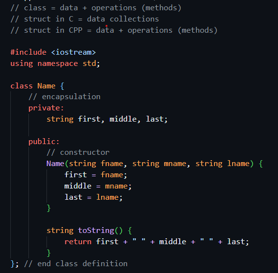

# Advanced Computer Programming Course in C++ 🚀

Welcome to the **Advanced Computer Programming Course** repository for C++! This project serves as a hands-on guide to mastering advanced C++ concepts, focusing on performance, robust architecture, memory management, and modern C++ standards.

## 📝 Overview

Moving beyond basic syntax, this repository explores how to write enterprise-level, efficient, and safe C++ applications. It transitions from standard procedural programming into complex paradigms, providing executable examples for deep technical understanding.

### Understanding C++ Classes
A core part of advanced C++ is designing efficient and secure object-oriented structures. Below is a visual representation of the class architecture covered in this course:



## 🧠 Key Concepts Covered

* **Advanced Object-Oriented Programming (OOP):** Deep dive into inheritance, polymorphism, abstract classes, and virtual destructors.
* **Memory Management:** Understanding the Stack vs. Heap, raw pointers, references, and avoiding memory leaks using **Smart Pointers** (`std::unique_ptr`, `std::shared_ptr`).
* **Standard Template Library (STL):** Efficient use of containers (like vectors, maps, and sets), iterators, and complex algorithms.
* **Generic Programming:** Writing scalable and reusable code using function and class **Templates**.
* **Modern C++ Features:** Utilizing C++11/C++14/C++17 features such as Lambda expressions, the `auto` keyword, move semantics, and robust exception handling.

## 📂 Repository Contents

* **`class.png`**: A visual diagram illustrating the class structures and OOP concepts discussed in the course.
* **Source Files (`.cpp` & `.h`)**: Contains the core logic, classes, and advanced C++ implementations discussed in the course.
* **Examples & Exercises**: Practical code snippets designed to test and solidify theoretical knowledge.

## 🛠️ Requirements & Setup

To compile and run the code in this repository, you will need a C++ compiler that supports modern C++ standards (e.g., GCC, Clang, or MSVC).

### How to run:

Clone the repository to your local machine:
```bash
git clone [https://github.com/marius2347/Advanced-Computer-Programming-Course-in-C-Plus-Plus.git](https://github.com/marius2347/Advanced-Computer-Programming-Course-in-C-Plus-Plus.git)
```

Navigate to the project directory:
```bash
cd Advanced-Computer-Programming-Course-in-C-Plus-Plus
```

Compile a standard C++ file (example using `g++`):
```bash
g++ -std=c++14 -o app main.cpp
```

Run the compiled executable:
* On Linux/macOS:
  ```bash
  ./app
  ```
* On Windows:
  ```cmd
  app.exe
  ```

### 🤝 Contributing
Feel free to fork this repository, explore the advanced scripts, and submit pull requests if you have any improvements, optimizations, or new C++ topics to add!

### 📬 Contact
If you have any questions, suggestions, or just want to connect, feel free to reach out:

**Email:** mariusc0023@gmail.com
